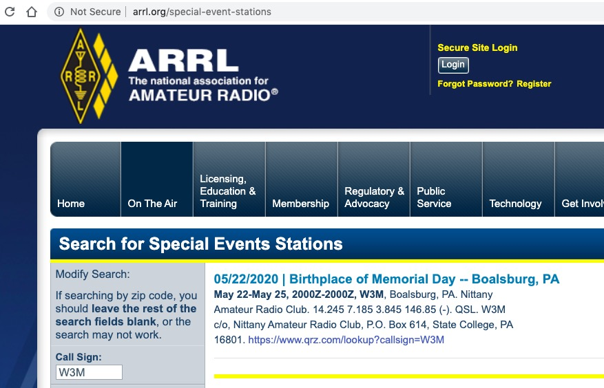
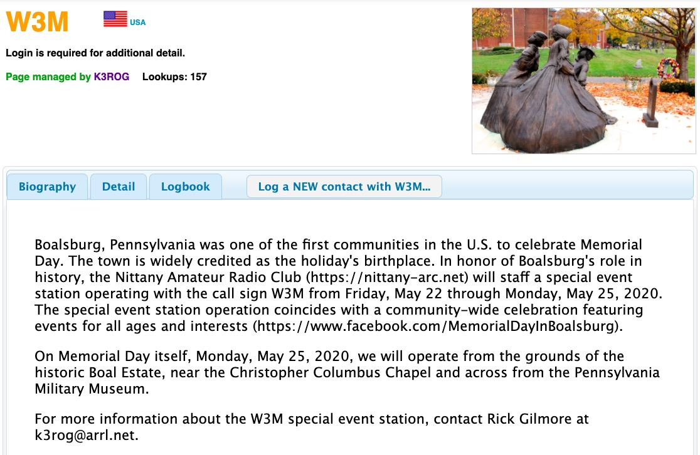

```{r setup, include=FALSE}
knitr::opts_chunk$set(echo = FALSE, fig.align = 'center')
```

## W3M

- Special event station
- Celebrating Boalsburg, PA, "The birthplace of Memorial Day"
- Friday, May 22 - Monday, May 25, 2020
- 80m, 40m, 20m, 15m?, 2m (146.85, 146.76), Allstar node 51401
- SSB, digital, CW, FM

---

```{r, out.width="750px", fig.cap="https://www.arrl.org/special-event-stations"}

```

---

```{r, out.width="750px", fig.cap="https://www.qrz.com/lookup?callsign=W3M"}

```

## Operating plan

- Friday 6p-10p
- Saturday 8a-8p
- Sunday 8a-8p
- Monday 8a-8p

## Who's signed up?

- Woody K3YV, Mike N3LI, Bob AD3K, 
- Brett W3SWL, Carmine K3CWP, Bill K3QP
- Lots of slots available: https://forms.gle/iTmtJXpqzFeDab5u9
- Operate a lot; operate a little. Have fun.
