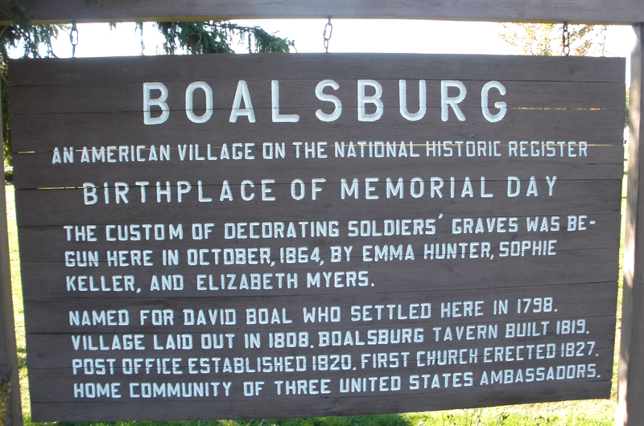
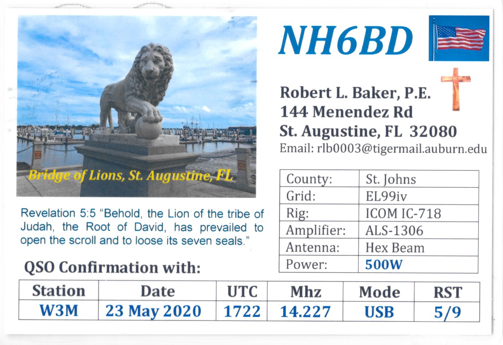

```{r setup, include=FALSE}
knitr::opts_chunk$set(echo = TRUE)
```

```{r, out.width="600px", fig.align="center", echo=FALSE}

```

# Overview

Boalsburg, Pennsylvania was one of the first communities in the U.S. to celebrate Memorial Day. The town is widely credited as the holiday's birthplace. In honor of Boalsburg's role in history, the Nittany Amateur Radio Club (https://nittany-arc.net) will staff a special event station operating with the call sign W3M from Friday, May 22 through Monday, May 25, 2020. In a typical year, the special event station operation would coincide with a community-wide celebration featuring events for all ages and interests (https://www.facebook.com/MemorialDayInBoalsburg). In 2020, the community-wide celebration has been cancelled, but the W3M special event station will go on thanks to hams operating from their own home stations.

Look for W3M operators on or around 3.845 MHz, 7.190 MHz, and 14.245 MHz, on standard digital mode "watering holes", in the slower portions of the CW sub-bands, on Allstar node 51401 or Echolink 495344. 

We plan to operate as follows:

Friday, May 22 -- 1800 to 2200 (6p-10p) EDT</br>
Saturday, May 23 -- 0800 to 2000 (8a-8p) EDT</br>
Sunday, May 24 -- 0800 to 2000 (8a-8p) EDT</br>
Monday, May 25 -- 0800 to 2000 (8a-8p) EDT

To receive a QSL card, please send a self-addressed stamped envelope with your QSL information or card to:

W3M
c/o Nittany Amateur Radio Club</br>
P.O. Box 614</br>
State College, PA 16801</br>

For more information about the W3M special event station, contact Rick Gilmore at k3rog\@arrl.net.

## On the web

The event is publicized on the ARRL Special Event Station site (search for W3M):

http://www.arrl.org/special-event-stations

We also have a QRZ.com page:

https://www.qrz.com/lookup?callsign=w3m

And, of course the current site:

https://nittany-amateur-radio-club.github.io/W3M

# Operating details

K3ROG suggests that the W3GA 146.76 repeater be used to coordinate among operating stations.

There is an APRS object centered on the Three Ladies Statue:

https://aprs.fi/#!mt=roadmap&z=11&call=a%2FW3M&timerange=3600&tail=3600

## Schedule

We are coordinating operations via this Google sheet:

https://docs.google.com/spreadsheets/d/1W_eP420R66SuLO1nc_NljsbGin8K4pkn3LkPWZuFk8c/edit?usp=sharing

Please enter your callsign, band, and mode.

## Frequencies

**75m/80m**: 3.578Mhz (JS8Call), 3.580 (PSK31), 3.590 (CW), 3.845 MHz (LSB)</br>
**40m**: 7.070 (PSK31), 7.078Mhz (JS8Call), 7.111 MHz (CW), 7.190 MHz (LSB)</br>
**20m**: 14.078Mhz (JS8Call), 14.070 MHz (PSK31), 14.245 MHz (USB)</br>
**15m**: Band conditions permitting...</br>
**2m**: 146.85 W3YA repeater (-600 kHz, 146.2 Hz PL)</br>
**Allstar**: node 51401</br>
**Echolink**: node 495344</br>

## QSO templates

These are just suggestions to get you going.
Feel free to improvise.
Have fun. 
Work as many or as few stations as you feel like.

### Phone

> CQ CQ CQ This is W3M Whiskey Three Memorial. Celebrating Boalsburg Pennsylvania, the birthplace of Memorial Day. W3M calling CQ and listening.

> QRZ Whiskey Three Memorial.

### Digital modes

> CQ CQ W3M W3M special event station celebrating Boalsburg PA the birthplace of Memorial Day pse k

> QSL by sending SASE and QSL card/info to W3M c/o Nittany Amateur Radio Club, P.O. Box 614, State College, PA 16801.

### CW

> CQ CQ CQ W3M W3M W3M special event k

> <THEIR-CALL> <THEIR-CALL> de W3M  --- tu ur rst 5nn 5nn in boalsburg pa ? boalsburg pa --

> birthplace of memorial day --

> qsl info on qrz -- hpe cu agn 73 73 sk <THEIR-CALL> de w3m

# Operation report

The following operators participated: WA3FET, K0LO, K3CWP, N3LI, K3QP, K3ROG, W3SWL, & K3YV.

QSO counts are still coming in, but we had > 1,800 phone contacts, > 75 CW contacts, & > 40 digital (FT8, PSK31, JS8Call) contacts.

Two CW operators emailed me to report that they'd made their first CW QSOs with our station.
One phone operator emailed me to say that he'd made his first HF contact with our station.
K3ROG contacted a JE station for his first-ever contact from that country.
One SWL listener from Iraq reported hearing our CW station at 499.

## Emails received

>"*Thanks for being patient with me during my first cw contact with you....I logged you as W3M, is this correct?  I know I was very sloppy and I will be more prepared as to what to say for my next contact.  My radio is a Yaesu ftdx-3000 and I was running 30 watts to a g5rv antenna in my attic.*"

>"*I wanted to say hello as you were the first contact I have ever had on HF. I just recently upgraded to General last Saturday. I would love to get a QSL card from you if that is possible.*"
> "*Being I am new to this I don't quite yet have a QSL Card of my own. I actually was talking to you on a Yaesu FT-1000 with a homemade sloped Dipole only 26 feet in the air. I am in Wellington, CO to give you an idea of where I am.*"
>"*I am originally from Gouldsboro, PA born and raised until I moved to Colorado in 2010 for the Army.*"

>"*Hello! I just worked the station on 7.111 CW, and just wanted to say thank you for the op for being patient and working me on CW! That was my first ever CW QSO on HF! Ive been working in trying to learn code for a few years, and finally decided to give it a try today. Once again thanks and 73*"

## QSLs

K3ROG received one QSL card in the mail on Tuesday.

```{r, echo=FALSE}

```

K3ROG and K3YV are working on a QSL card inspired by the "Three Ladies" statue.

```{r, echo=FALSE, message=FALSE, warning=FALSE}
library(tidyverse)
w3m_2020 <- readr::read_csv("csv/w3m-qsos.csv")

w3m_stats <- w3m_2020 %>%
  dplyr::select(., qsos, mode) %>%
  dplyr::group_by(., mode) %>%
  dplyr::summarise(., tot_qsos = sum(qsos))

ggplot(w3m_stats) +
  geom_col(aes(mode, tot_qsos, fill=mode))
```

## Suggestions for next year

1. Shorten the operating period.
2. Have more involvement in event planning.
3. Have more event promotion.
4. Try to expand CW and digital participation.

